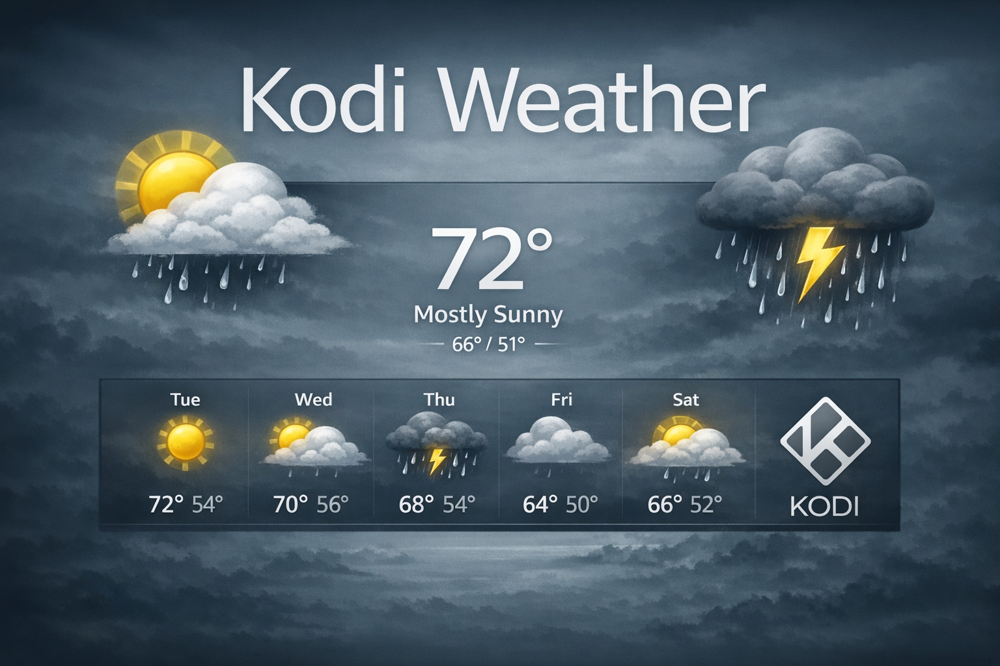

# Kodi Weather


A weather addon for Kodi focused on US locations. Provides current conditions, multi-day forecasts, hourly forecasts, animated NEXRAD radar maps, air quality data, and NWS weather alerts.



## Features

- **Current Conditions** — Temperature, feels-like, humidity, wind, pressure, UV index, visibility, dew point
- **7-Day Forecast** — Daily high/low, conditions, precipitation probability, wind
- **24-Hour Forecast** — Hourly temperature, conditions, precipitation probability, wind
- **Animated NEXRAD Radar** — Live NEXRAD radar via IEM (Iowa Environmental Mesonet) with classic green/yellow/red colors and burned-in timestamps
- **NWS Weather Alerts** — Real-time National Weather Service alerts with severity filtering (Notice/Caution/Danger levels)
- **Air Quality Index** — US EPA AQI with pollutant breakdown
- **Up to 4 Locations** — Quick switching between saved locations

## Data Sources

| Data | Provider |
|------|----------|
| Weather forecasts | [Open-Meteo](https://open-meteo.com) |
| Current conditions | [Met.no](https://api.met.no) |
| NEXRAD Radar | [IEM / Iowa State](https://mesonet.agron.iastate.edu) |
| Weather alerts | [NWS API](https://api.weather.gov) |
| Air quality | [Open-Meteo Air Quality](https://open-meteo.com) |
| Geocoding | [Nominatim](https://nominatim.openstreetmap.org) (US only) |
| GeoIP fallback | [ip-api.com](http://ip-api.com) |

## Requirements

- Kodi 19 (Matrix) or later
- Python 3.x
- Dependencies (installed automatically):
  - `script.module.requests`
  - `script.module.dateutil`
  - `script.module.pytz`
  - `script.module.pil`

## Installation

1. Download the latest release zip from [Releases](https://github.com/Echo-Storm/weather.kodiweather/releases)
2. In Kodi: **Settings → Add-ons → Install from zip file**
3. Select the downloaded zip
4. Go to **Settings → Weather** and select "Kodi Weather" as your provider
5. Configure your location(s) in the addon settings

## Settings

### Locations
- **Location 1-3** — Always available
- **Location 4** — Available when expanded locations enabled
- Per-location options: custom display name, enable/disable maps, enable/disable alerts, timezone override

### Maps
- **Map Zoom** — Zoom level for radar tiles (default: 6)
- **Map History** — Number of historical radar frames to cache
- **Radar** — Enable/disable radar map fetching

### Notifications (NWS Alerts)
- **Enable NWS Alerts** — Master toggle for weather alerts
- **Notice Level** — Show minor advisories (default: off)
- **Caution Level** — Show watches and moderate warnings (default: on)
- **Danger Level** — Show severe warnings and emergencies (default: on)

### Advanced
- **Icon Set** — Weather icon style
- **Forecast Days** — Number of days in extended forecast
- **Debug/Verbose Logging** — For troubleshooting

## Skin Integration

The addon sets standard Kodi weather window properties. Compatible with any skin that supports the weather window.

### Key Properties

```
Window.Property(Current.Temperature)
Window.Property(Current.Condition)
Window.Property(Current.FeelsLike)
Window.Property(Current.Humidity)
Window.Property(Current.Wind)
Window.Property(Day0.Title) through Day6.Title
Window.Property(Day0.HighTemp) through Day6.HighTemp
Window.Property(Day0.LowTemp) through Day6.LowTemp
Window.Property(Hourly.1.Time) through Hourly.24.Time
Window.Property(Hourly.1.Temperature) through Hourly.24.Temperature
Window.Property(Alerts.IsFetched)
Window.Property(Alerts.0.Status) through Alerts.N.Status
```

### Radar Map Properties

```
Window.Property(Map.1.Area)       -- Base map (OSM tile composite)
Window.Property(Map.1.Layer)      -- Latest radar frame
Window.Property(Map.1.LayerPath)  -- Folder path for multiimage animation
Window.Property(Map.1.Heading)    -- "Radar"
Window.Property(Map.1.Time)       -- Timestamp of newest frame
Window.Property(Map.1.FrameCount) -- Number of cached frames
Window.Property(Map.1.Layer.0)    -- Individual frame paths (newest first)
Window.Property(Map.1.Time.0)     -- Individual frame timestamps
```

### Radar Animation (Skin Requirement)

To display animated radar, your skin must use a `<multiimage>` control:

```xml
<control type="multiimage">
    <imagepath>$INFO[Window.Property(Map.1.LayerPath)]</imagepath>
    <timeperimage>500</timeperimage>
    <pauseatend>2000</pauseatend>
    <loop>yes</loop>
    <randomize>false</randomize>
</control>
```

Each radar frame has its timestamp burned into the image (bottom-right area).

## US-Only Limitations

This addon is designed for US locations:
- Geocoding restricted to United States
- NWS alerts only available for US locations
- Units default to US standards (°F, mph, inHg, miles)

## Known Limitations

- **US-only radar** — IEM NEXRAD covers CONUS only (Continental United States)
- **Radar animation requires skin support** — Your skin must use a `<multiimage>` control to display the animation; otherwise only the latest frame is shown

## Credits

- Original fork from [weather.openmeteo](https://github.com/forynski/weather.open-meteo) by forynski
- Weather data: Open-Meteo, Met.no, NWS
- NEXRAD Radar: Iowa Environmental Mesonet (Iowa State University)
- Icons: Various (see icon set credits in addon)

## License

- MIT

## Version History

See [CHANGELOG.md](CHANGELOG.md) for detailed version history.

**Current Version: 2.4.2**
